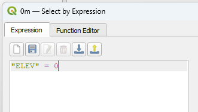

## Contour Extraction
With the merged raster appropriately coloured, we can generate elevation contours from it. This will be the basis for the laser cut .SVG files. From the Raster menu, navigate to ‘Extraction’ and ‘Contour’.  

  Keep all default parameters in the window and ensure the input layer is your merged raster. Click ‘Run’. 

 Uncheck the merged raster layer in the layers pane to view only the line contours. 

 Before making any other edits, right-click the contour layer you generated  in the layers menu and save it. to your project files (Export -> Save Features As). It should default to saving as an ESRI shapefile (.shp).  
 As we are focusing on bathymetry, we need to remove all contour lines above 0m. To do so, right-click the ‘contours’ layer in the contents pane. From the menu, select ‘open attribute table’.  

  With the attribute table open, navigate to the ‘Select feature by expression’ tool at the top of the page. 

  The expression editor will open. Type or copy “ELEV” > 0 into the window. Click ‘select features’ at the bottom of the window to complete the process. 

 You will see that all contour lines with values greater than zero are now highlighted in yellow on the map. 

 Right-click the layer in the list. Click ‘toggle editing’.  

 From the toolbar at the top of the window, click ‘delete selected’. Confirm your selection in the pop-up. If your file contains outlying squares like these: 

 They will need to be removed, as they will complicate the rest of the data editing process. If there are no outliers, proceed to the ‘saving edits’ step. If your dataset contains outliers,  keep layer editing enabled, open the ‘select features’ menu, and open the ‘select by freehand’ tool. 

 Work slowly to ensure necessary features are not selected accidentally. If that happens, click the ‘Remove selection’ tool to clear all features from selection.  

 Unnecessary features can be deleted the same way the elevation lines above 0m were deleted. When you have all extraneous features removed, save all edits to the layer and switch editing off (the single pencil icon next to the save tool). 

 Now is a good time to save your project.  
 Reopen the contour layer’s attribute table. Open the ‘select by attribute’ tool. Input “ELEV” = 0. With the selection made, right-click the layer and navigate to ‘save selected features as’. Change the format from an ESRI shapefile to an AutoCAD DXF. Save the file to your project folder. You may save it to a new subfolder for the final design layers. A popup will appear after saving the file. Click ‘Add Layer’ to proceed. These layers are being added only for visualization purposes and will not need to be manipulated further. 

 Repeat this process for “ELEV” = -50, -100, and -150, remembering to clear the selection between groups. 

 If there are no features available for a depth of -150, work backwards by 10m increments until features are selected successfully. If you would like to experiment with selecting different depth measurements, you are welcome to. Ideally, limit it to three or four layers plus the 0m layer. Deselect the original contours from the layers menu to see what the extracted layers look like on their own. Here is my example.  

 Now is a good time to save your project. 

