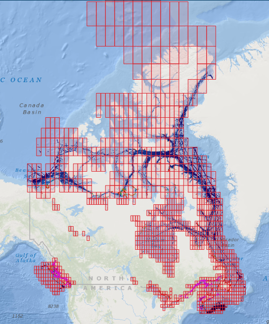
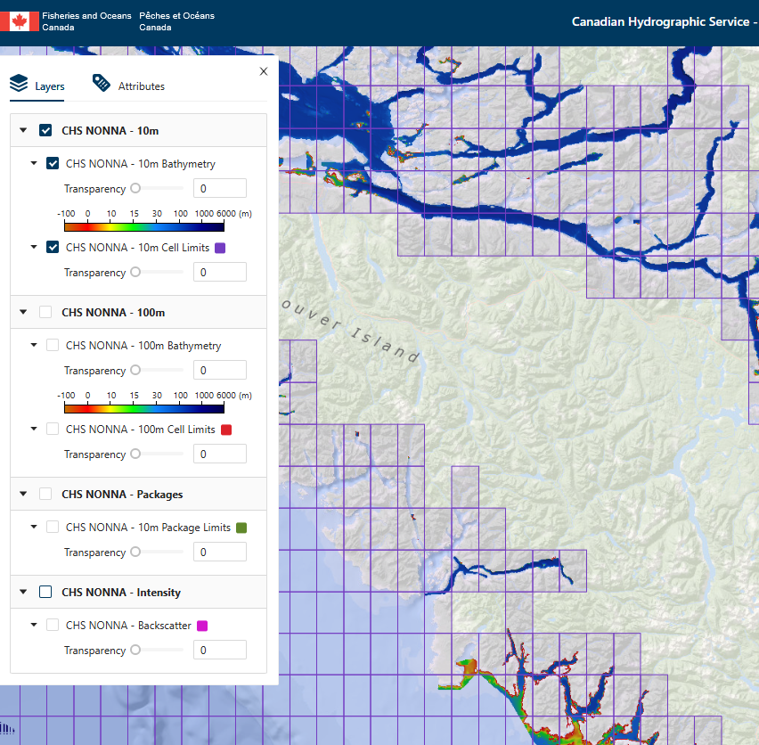
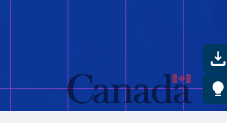
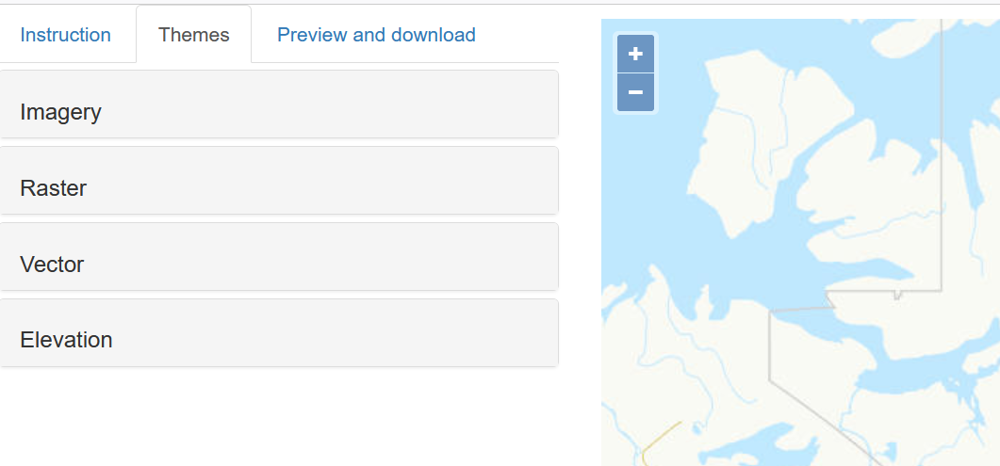

## Data Downloads
To get started, navigate to the [Canadian Hydrographic Service Bathymetric Data Portal](https://data.chs-shc.ca/dashboard/map){:target="_blank"}. Accept the terms of use and log in as a guest. The initial view shows all regions where bathymetric data is available. It is available in 100m and 10m resolutions.  
 
 We will be using 10m data for this project, so deselect the 100m and Intensity layers from the layer table on the left. Zoom in to where the 10m grid is visible. 
 
Data is reliably available for the East and West coasts, as well as for the Great Lakes.
- When you have decided on an area to map, **select its 10m grid square**.
- From the **‘Attributes’** tab of the menu, ensure the **CHS NONNA - 10m layer** is selected. There is no cost to accessing the data.
 
- Click the **add to cart** button at the top left of the screen, then access your cart from the icon at the top right. Deselect all data formats from the menu, except **‘GeoTIFF’**. The GeoTIFF format embeds geospatial metadata into image files such as aerial photography, satellite imagery, and digitized maps so that they can be used in GIS applications.
- Click the **Next** button in the cart menu twice, then download your data. 

When your files have downloaded, be sure to save them to an easily available folder on your desktop.  
***All files downloaded or created during this project MUST be saved to your computer's Downloads folder. QGIS cannot properly read files from other folders.***
 Right-click the zipped folder and select *‘Extract all’* to access the files individually. Now go to the [Canadian elevation data portal](https://ftp.maps.canada.ca/pub/nrcan_rncan/vector/index/html/geospatial_product_index_en.html){:target="blank"}. Navigate to the area you have chosen to work with. Click the *‘Themes’* tab, then select *‘Elevation’*. Select the *Canadian Digital Elevation Model*.  
 

Click on the tile that contains your region of interest. This tile will cover more area than the bathymetry data. It will be trimmed later. A download link will appear on the left side of your screen. Click it to access the elevation data. Save it to the same folder as your bathymetry data and unzip it. Renaming the resulting folder can make your files easier to navigate and work with. Now you are ready to work with the files in QGIS. 

[NEXT STEP: Edit Raster Data](raster-data.html){: .btn .btn-blue }
