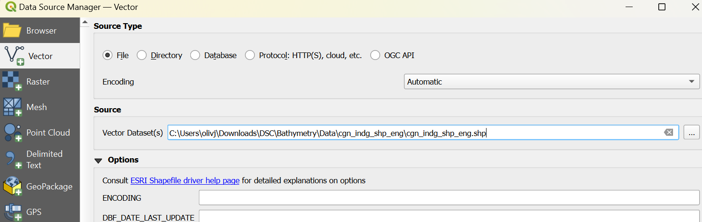
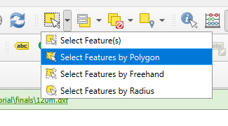
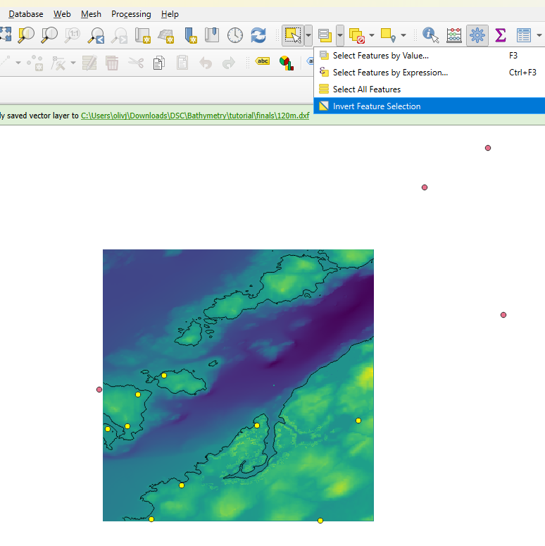
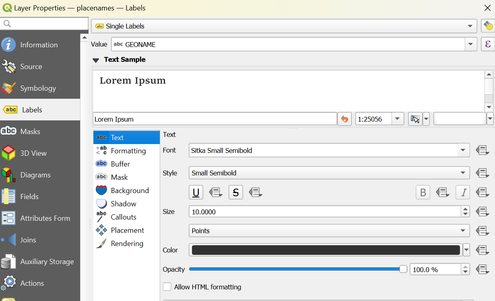
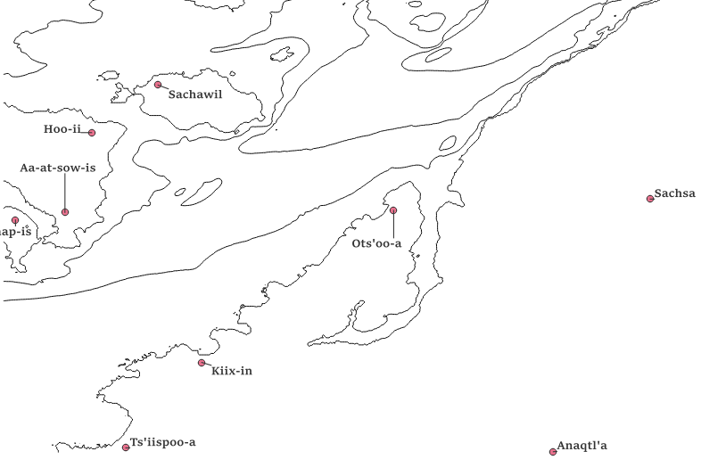
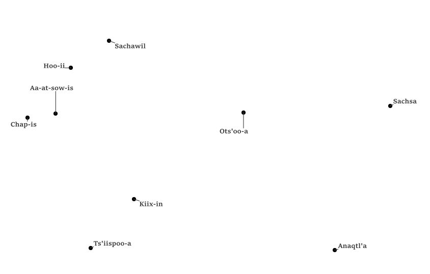

## Engraving
This section presents two options for engraving details on your map. The first is placenames, which will be show as points and text labels. Both Indigenous and government place names are available for use. The second option is engraving streets, which will be shown as a series of lines. For rural areas the placenames are likely to be more suitable as there are fewer streets in remote areas. Urban areas have plenty of both types of data. Note that the placename configuration process can be a bit finicky, so if you do not enjoy detail work the streets can be easier. 
## Placenames - Option 1
To get started, download [this file of Indigenous place names:](https://ftp.maps.canada.ca/pub/nrcan_rncan/vector/geobase_cgn_toponyme/prov_shp_eng/cgn_indg_shp_eng.zip){:target="_blank"}. Right-click the packaged files and select ‘extract all’ to unzip the folder to a location within your project file. Open the data manager from the top left corner of the QGIS menu and navigate to the ‘add vector data’ option.  

  *if there is no Indigenous placename data available in your area, [an alternative placename file can be downloaded here:](https://natural-resources.canada.ca/earth-sciences/geography/download-geographical-names-data/9245){target="blank"}. Find the relevant province on the list and download the .shp file, then follow the rest of the instructions normally.*   
 Select only the .shp file from your folder. Add it to your project and rename it to ‘placenames’. This dataset covers all of Canada (or all of a province), so it will need to be trimmed to your area of interest. Go back to the select features tool and choose the ‘select by polygon’ option. 

 Turning the merged raster layer back on can make the extent of the area being mapped more visible. Draw a polygon around the area of the raster to select the appropriate feature markers. To the right of the select tool we have been using is another tool that allows for selections to be inverted.  

 Invert the selection. Turn layer editing on for the placenames layer, delete all selected features, save the layer edits, and turn layer editing off again.
Right-click the place names file from the layers pane and open the properties menu. Go to the ‘labels’ tab and select ‘single labels’ from the dropdown at the top. The value should default to ‘GEONAME’. If not, change it over. You are welcome to experiment with fonts. However, it is recommended to keep the font size around 10 (points, not mm). Go to the ‘Callouts’ tab and enable callouts.  Click ‘Apply’ at the bottom of the window to visualize the changes. 

 From the side panel, open the symbology menu. Change the points to be all black and approximately size 2.6. Click ‘OK’ to close the properties window. 

 In order for the labels to be engraved successfully, they must all be on the 0m layer. From the top toolbar,  select the label icon with the arrow. This allows for labels to be manually repositioned. 

 If a warning appears, click  ‘OK’. Move the text around until it is all contained on the 0m layer. It should resemble the example, where there is no overlap between contour lines and text. 

 Turn off all contour layers to see just the labels and points. Take a screenshot including all labels and points, like the example below. Save this file as a .png to your project folder. 

## Streets - Option 2
