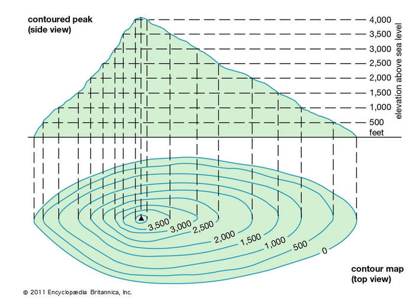

# Laser Cutting Ocean Floor Contour Maps

- Pre-workshop activities: 15 min 
- Introductory presentation: 10 min
- Hands-on activities: 60-90 min
  
## Why Bathymetry? 

Ocean Floor Contour Maps, AKA [Bathymetry](https://oceanservice.noaa.gov/facts/bathymetry.html){:target="_blank"}. Bathymetry is the study and visualization of the ‘beds’ or ‘floors’ of bodies of water. A bathymetric map of Victoria Harbour would show contours of the ocean floor and relative water depth. It can be thought of as underwater topography. Contour maps are a way of displaying elevation change in a 2D format. Areas of equal elevation are connected by concentric lines at set intervals. The example below shows 500 metre elevation increases. In addition to being useful for navigation, planning, and visualization, contour maps can also be quite beautiful and make a good subject for artistic mapping.  
 

[QGIS](https://qgis.org/) is a geographic information system software that is free and open-source. It supports viewing, editing, printing, and analysis of geospatial data in a range of data formats.
[Inkscape](https://inkscape.org/) is a free and open source design tool for making and editing vector graphics. Inkscape uses the standardized SVG file format as its main format, which is supported by many other applications including web browsers.

## Learning objectives

At the end of this workshop, you will be able to:
1. Use open-source data portals to find appropriate geospatial data. 
2. Generate and edit vector contours from raster datasets in QGIS. 
3. Create a bathymetric map of an area of your choice.
4. Work comfortably with vector and raster data in QGIS.
5. Generate and edit labels in QGIS.
6. Use Inkscape to convert a DXF file into a SVG suitable for the laser cutter.
7. Understand efficent laser cut formatting.  

 
[NEXT STEP: Pre-Workshop Activities](pre-workshop.html){: .btn .btn-blue }
