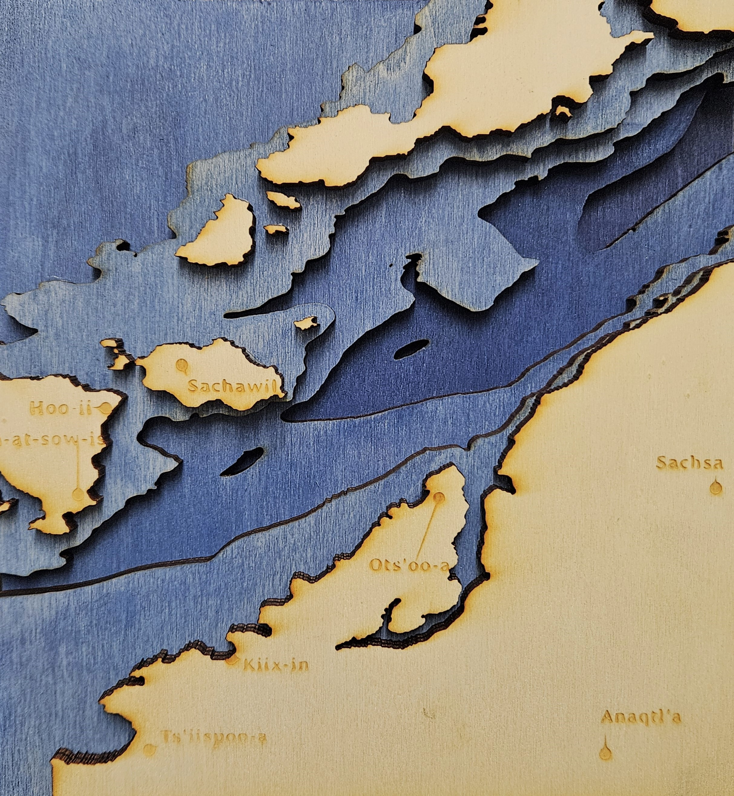
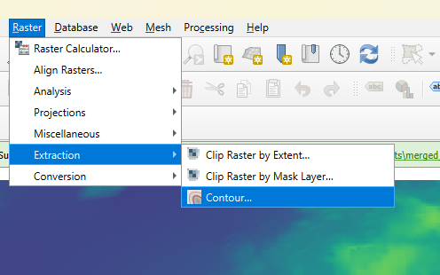

# Laser Cut Bathymetry Mapping

## Why Bathymetry? 

[Bathymetry Definition:](https://oceanservice.noaa.gov/facts/bathymetry.html){:target="_blank"} Bathymetry is the study and visualization of the ‘beds’ or ‘floors’ of bodies of water. A bathymetric map of Victoria Harbour would show contours of the ocean floor and relative water depth. It can be thought of as underwater topography. Contour maps are a way of displaying elevation change in a 2D format. Areas of equal elevation are connected by concentric lines at set intervals. The example below shows 500 metre elevation increases. In addition to being useful for navigation, planning, and visualization, contour maps can also be quite beautiful and make a good subject for artistic mapping.  
 

[QGIS](https://qgis.org/) is a geographic information system software that is free and open-source. It supports viewing, editing, printing, and analysis of geospatial data in a range of data formats.
[Inkscape](https://inkscape.org/) is a free and open source design tool for making and editing vector graphics. Inkscape uses the standardized SVG file format as its main format, which is supported by many other applications including web browsers.

## Learning objectives

At the end of this workshop, you will be able to:
1. Generate and edit vector contours from raster datasets in QGIS. 
2. Create a bathymetric map of an area of your choice, including placenames and/or street data.
3. Convert a DXF file into a SVG suitable for the laser cutter in Inkscape. 

 
[NEXT STEP: Pre-Workshop Activities](pre-workshop.html){: .btn .btn-blue }
