## Inkscape contour formatting 
Open the Inkscape program and select *‘new document’* from the startup menu. From the document’s file menu, import your -150m DXF file. 
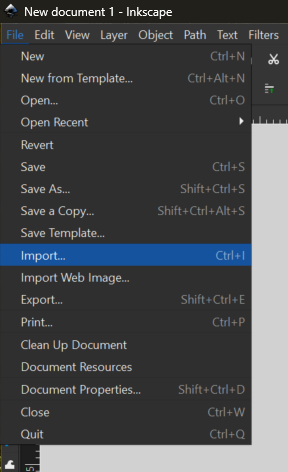
 Ensure that scaling is set to *‘automatic to A4*’ and character encoding is UTF-8. 
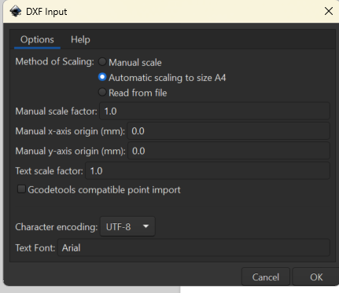
 A warning will appear - this happens with every DXF file and will not affect your project. Click OK to load the file into the document. Move it so that the edges of the layer align with the edges of the document. Refer to your QGIS window for the correct scaling.  
 From the menus at the right of the screen, open the *‘fill and stroke’* options. Set fill to null (the X value) and the stroke to flat colour, with 100% opacity and a red value of 255. Under stroke style, set the width to **0.1mm**. This allows the lasercut program to read these designs as cut lines, rather than as shapes to be engraved. Repeat this process with the rest of your files, opening them in new Inkscape windows. Ensure the fill and stroke values are all set to the above parameters.  
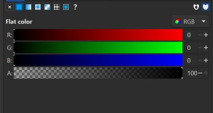
 When you have opened and formatted all your contour files in different Inkscape windows, look through them. At least one of your layers should have cut-off lines indicating the upper boundaries of the project file, like the example below. We will use these boundaries to define a consistent area for each layer of the project. 
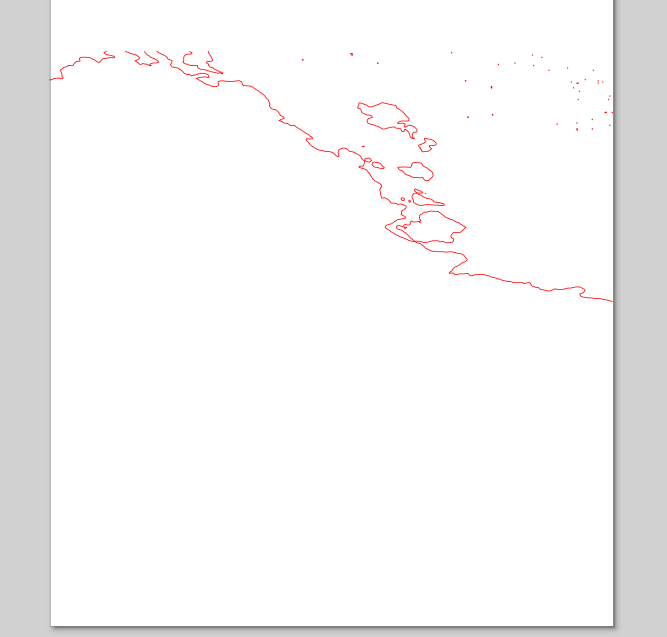
 Navigate to the rectangle tool in Inkscape’s left-hand menu and use it to draw a rectangle around the edges of your project (click and drag . Use the cut-off lines as a guide for the top border. Ensure the rectangle’s fill and stroke settings are the same as the contour lines (0 fill, solid stroke, red value 255, line width 0.1 mm). 
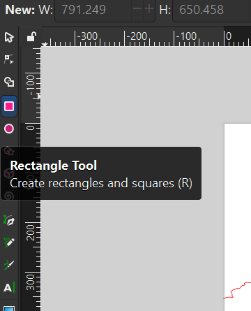
 Select the rectangle in the layers pane and copy it to your clipboard. 
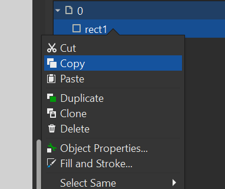
  Go into your other Inkscape windows and paste the rectangle into each of the files. Line up the bottom corners with the edges of the page. Now the layers are all the same size. When all layers include the border rectangle, open the File menu from the top left of the Inkscape window. Select *‘Save As*’ and save your layer as an .SVG file (the default file type for Inkscape).   
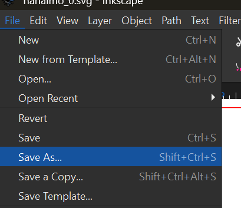  
## Inkscape placename formatting
 With the 0m contour file open, use the *Import* tool to bring in the screenshot of the place names if you used them. If you used street data to create features for engraving, skip these steps. Ensure the image render mode is set to Smooth. 
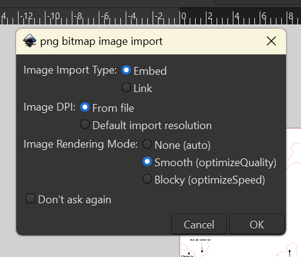
 In the Layers pane, turn off visibility for the contour line layer, leaving the placenames visible.  
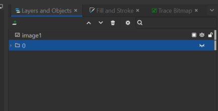
 From the upper menu, open the *Path* tab and select *Trace Bitmap*.  
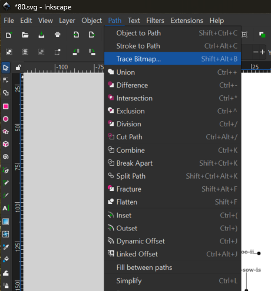
 The tool will open in the right-side panel. Ensure the label layer is selected in the Objects menu. Bitmap trace should default to single scan mode. A brightness cutoff of around 0.66 should be effective. When the preview looks good, click *‘Apply’*.  
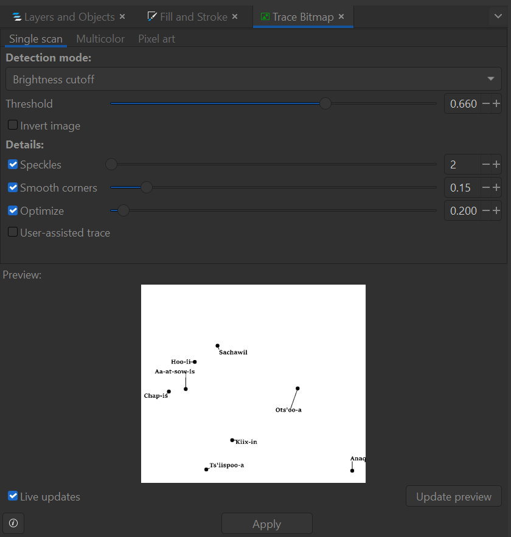
 This converts the .png image of labels into a path format suitable for laser engraving. Navigate back to the layers tab and turn visibility off for the original screenshot, while turning it on for the 0m contour layer. Position the labels accurately on the 0m layer, using the QGIS project for reference. With this complete, set the fill of the label layer to solid, the stroke to none, and the colour to 0 in R, G, and B with 100% opacity. Do not edit the line weight. 
 
## Inkscape streets formatting
If you used street data, import it into the 0m contour layer with the same settings used to bring in the contour files. Move the layer around to match up with the 0m contours until it resembles the QGIS files (use QGIS as a reference). See example below (the images show Inkscape, then Q). 
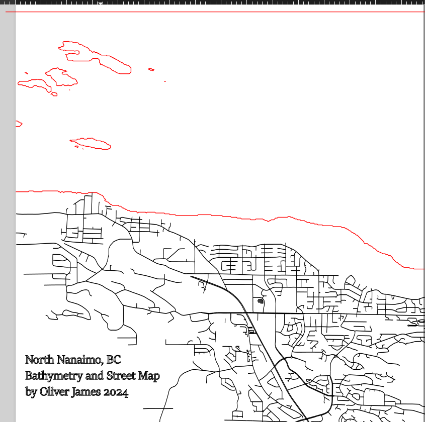 
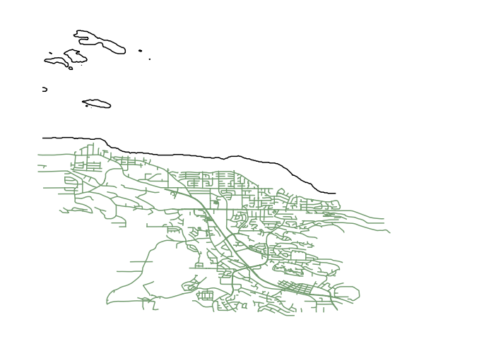
 The street layer should be formatted with no fill and flat colour for the stroke. The RGB values should all be set to 0, and the line width should be 0.1 mm. 
## Additional Text
If there is any other text you would like to add to your map, use the text tool from the left side of the window. 

 Like the labels and streets, text also has to be contained within the 0m contours. Right-click the text box you created to open its edit menu. Alter the font to your liking and ensure that the fill of the text is solid, the stroke is set to none, and the colour is set to 0 for the R, G, and B values with 100% opacity. Do not edit the line weight.  When you are happy with the labels/streets and any added text, save this final layer as a .SVG.  
## Efficent formatting
With your layers all formatted appropriately, the last step is to organize them as a single file for submission to the DSC portal.  Download the [DSC’s Full Sheet template here](https://drive.google.com/file/d/16DpKhRBPVkZwpf0v9KeHywDj_KNwX1TF/view?usp=drive_link){:target="_blank"}. Open it as a new document in Inkscape *(File > Open)*. Note that the real-life dimensions of the file are **59cm x 29cm**. With that in mind, import your 0m SVG file *(File > Import)*. The import should default to including the SVG as an object in the new file. If it does not, change the setting accordingly. 
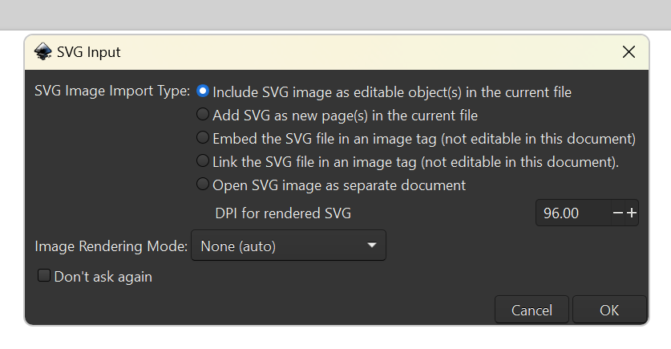
 Arrange the file so that the top and left edges of the square you drew around the map are aligned with the edges of the template. Size it as desired.  
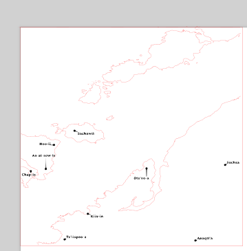
 Import the remaining SVG layers. Ensure they are the same size as the 0m layer. Arrange them on the template, leaving small gaps between the squares. 
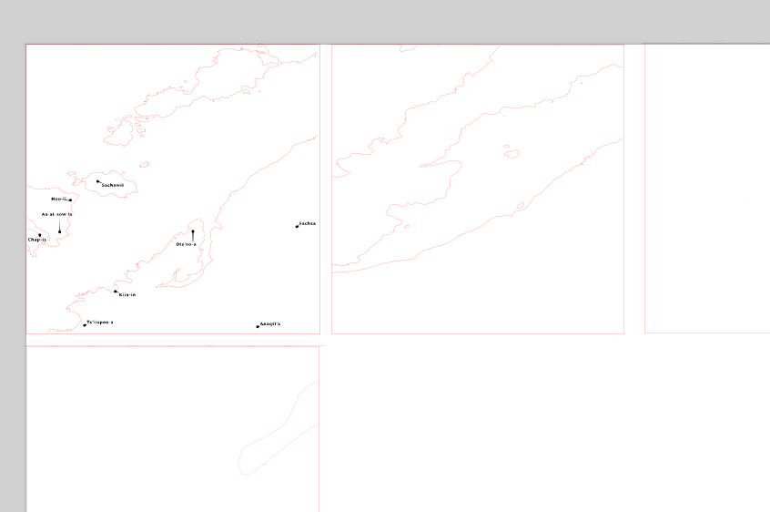
  When all your layers are arranged, save the SVG file as *“yourname_place”* or some similar title. 
