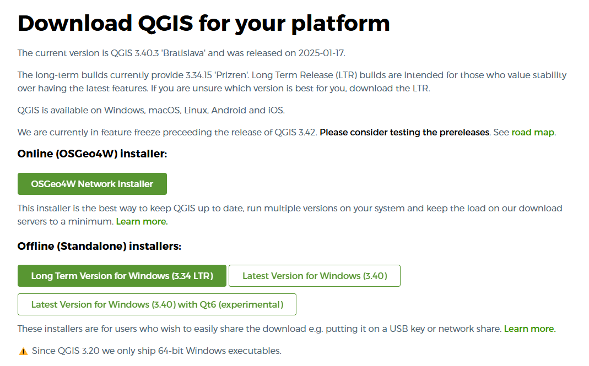
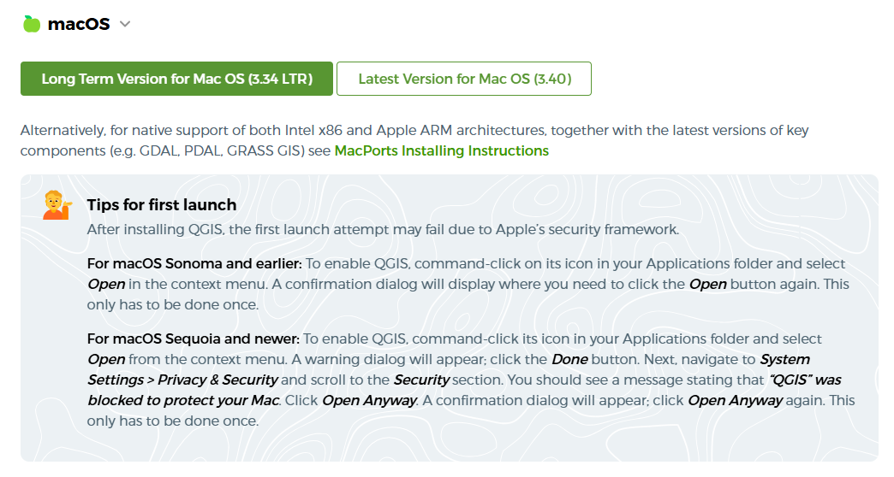
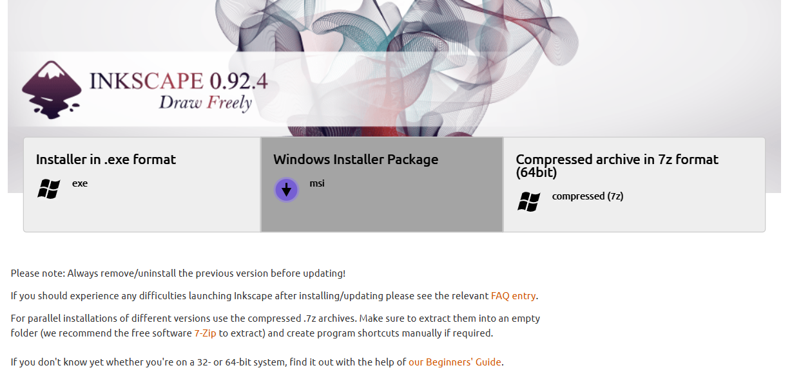

## Pre-Workshop Videos & Activities
Please note that it is recommended that you complete the [Intro to Design with Laser Cutting workshop](https://uviclibraries.github.io/laser/){:target="blank"} and at least one of the Intro to QGIS workshops before starting this tutorial. The Intro to Laser Cutting workshop is available asynchronously through the DSC website. The Intro to Q workshops are offered in-person, and registration information can be found on the [DSC's main page.](https://onlineacademiccommunity.uvic.ca/dsc/workshops/){:target="blank"}  
 This workshop is primarily hands-on practice with QGIS and Inkscape in order to learn to use key features of the software. To participate fully please do the following **before the workshop**:
Please install the Inkscape and QGIS programs on your computer prior to starting the workshop.
 [Download QGIS here](https://qgis.org/download/){:target="_blank"}
  For Windows: 
  
 Be sure to download the Long Term version. 
  For Mac: 
    
 [Download Inkscape here](https://inkscape.org/release/0.92.4/windows/64-bit/){:target="_blank"}  
   
[NEXT STEP: Introduction to Hands-On Activities](activities-intro.html){: .btn .btn-blue }
