## Raster Data Editing
**If you are having trouble with your QGIS project file, please check the Troubleshooting page for some common issues and solutions.** 
  [Open QGIS 3.32 Desktop.](https://qgis.org/download/){:target="_blank"} From the *‘Project’* menu, select *‘Save As’*. Navigate to your project file and save the QGIS project in the same folder as the rest of your data. Name it *'yourname_map'*. 
 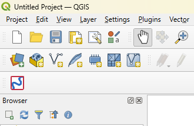 
 Now that the project is saved, you can add the files you downloaded earlier. To add data, open the Data Source Manager (the icon of three coloured squares). 
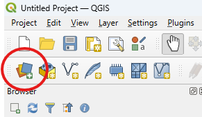 
From the popup, select *‘Raster’* from the left-hand menu. Click the three dots on the far right to navigate to the elevation data in your folder.  
 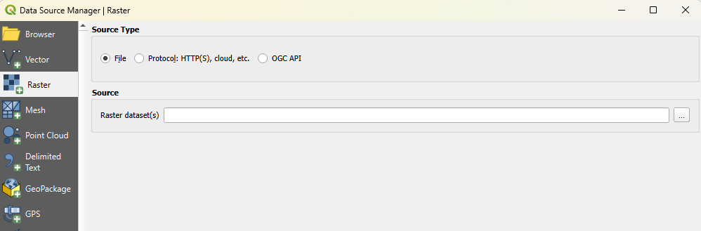 
 In the file explorer, select only the .TIF file, then click *‘Open’*.  
 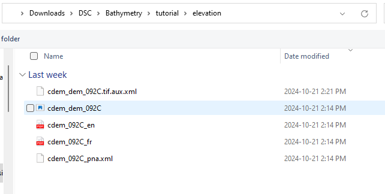 
 - From the QGIS data manager, click *‘Add’*. The data will appear in the main window as a continuous black-and-white image. 
- The legend to the left side shows that areas of higher elevation show as being lighter. The sample imagery has a maximum value of 1,478 metres and a minimum of 0 metres (sea level).
-  **Right-click** the layer in the menu to rename it to ‘elevation’. 
 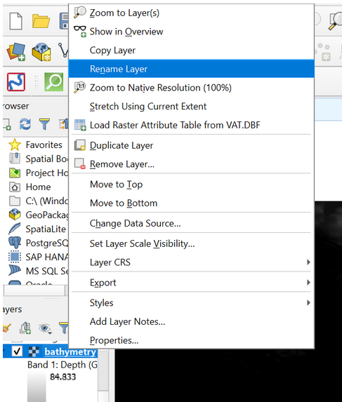 
- Repeat the New Data steps to add your bathymetry dataset (only add the .TIFF file) to the project. Be sure you rename it to *‘bathymetry’*.
- If you get a popup asking about coordinate transformations, click ‘OK’.
- This is a good time to save your project.  
 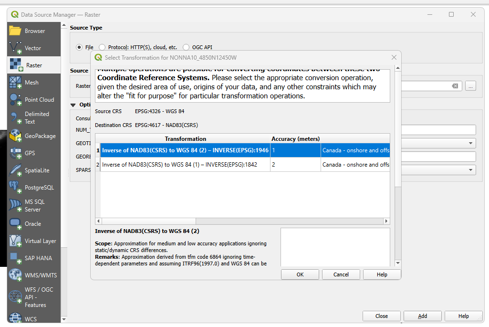 
 The bathymetry dataset covers a much smaller area compared to the elevation dataset.
- To set them equal, navigate to the *‘Raster’* tab at the very top of the screen.
- Select *‘Extraction’*, then *‘Clip Raster by Extent’*. 
 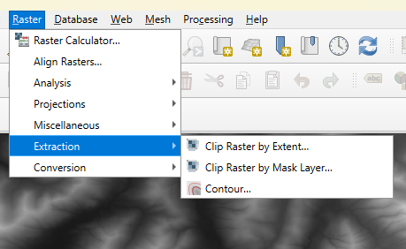 
- Select the elevation data as the **input** layer.
- For the clipping extent, select *‘Calculate by Layer’*, then choose the bathymetry data.  
 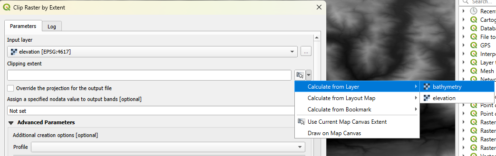 
- No other inputs are needed. Click *‘Run’*.
- A new layer will appear in the project. **Right-click** the layer name and select *‘Export’* from the options that appear.
- Click *‘Save As’*. From the popup, select the three dots to the right of the file name to save it to your project folder.
- Keep all default specifications and name it ‘elevation_clip’.
-  Click ‘OK’ at the bottom of the menu. This will save the data as a new file, instead of it existing as a temporary layer within the QGIS project.  
 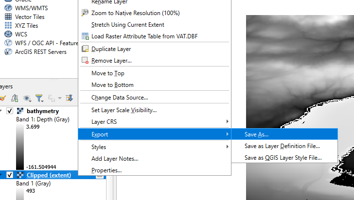 
 Note that the clipped elevation layer is overall lighter than the full elevation dataset. This is because it has a smaller range of values, but still displays the full shade range of the legend. Uncheck the box beside the unclipped elevation layer to see only your area of interest. It should look similar to the example below. Save your project again.  
 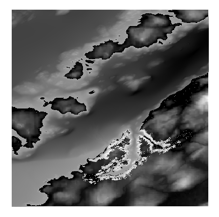 
 With the elevation layer trimmed to match the bathymetry, we can merge the two raster layers together. From the toolbar at the top of your window, select *‘Raster’*, then the *‘Miscellaneous’* menu. From there, click *‘Merge’* to open the tool.  
 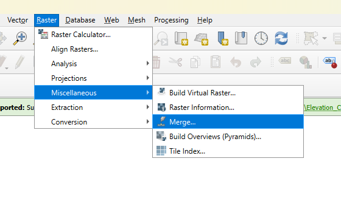 
 From the *‘Input Layers’* bar, click the three dots on the right to open the layer selection.Select your ‘bathymetry’ and ‘elevation_clip’ layers, and drag the elevation layer such that it is at the **top of the order** if it isn’t there already.  
 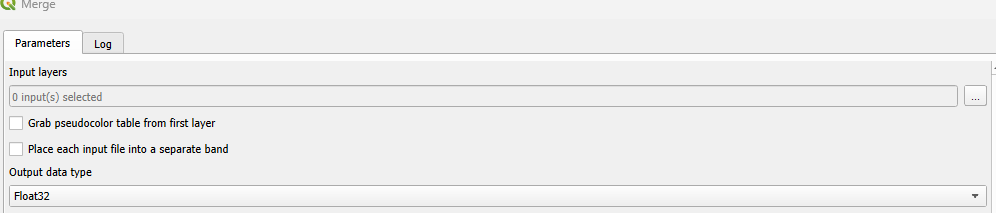 
  Change the output data type to *‘Float64’*. **Leave all other default parameters**.  
 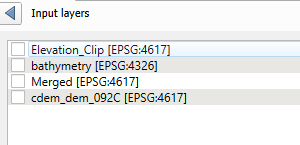 
- Click the *‘Run’* button at the bottom of the window.
- Save the new raster layer to your files by right-clicking it in the layers menu and selecting *‘Export’*, then *‘Save As’*.
- Name the layer *‘Merged_Raster’*. Turn visibility off for all other layers.
- To help visualize the new merged raster, right-click it in the menu and select the *‘Properties’* tab at the bottom of the pop-up menu.
-  From the window that opens, go to the *‘Symbology’* tab. Change the render type to ‘singleband pseudocolour’.
-  Experiment with different colour options to find one that helps you ‘read’ the map. I will be using Viridis.
-  To test colour schemes without closing out of the menu, click *‘apply’* at the bottom of the window. When you are happy with the colour ramp, click *‘OK’* to close the menu.  
 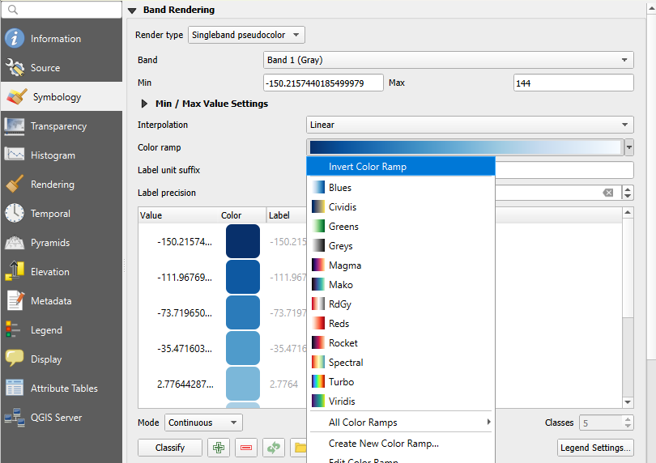 
 This is a good time to save your project.  
 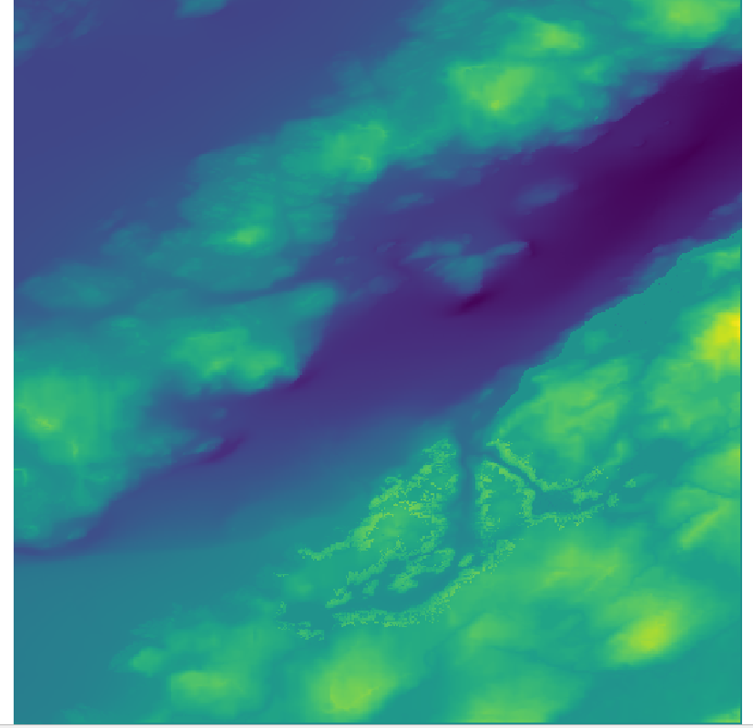 

[NEXT STEP: Extract Vector Contours](contour.html){: .btn .btn-blue }
