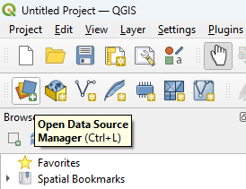
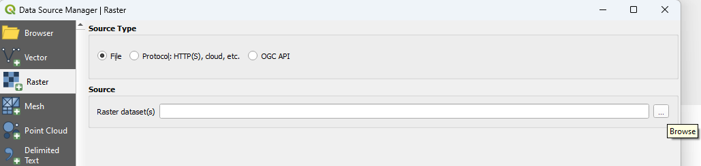
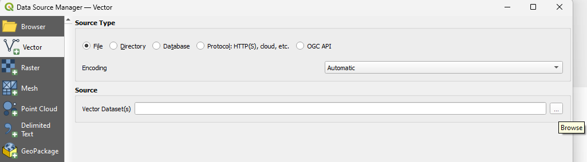

## Troubleshooting 
QGIS can be tricky! This section will address common issues that can arise when going through the workshop.   
  **I removed a layer from Q!** 
It is important to note that removing a layer from QGIS is not the same as deleting it from your files. If you need to reopen a layer, go to the Data Source Manager at the top left of the QGIS window.  
  
For raster data (bathymetry and elevation continious data layers), use the Add Raster Data tool and select the appropriate file from your downloads. 
  
  For vector data (placename points, contour lines), use the Add Vector Data tool and select the appropriate file from your downloads.  '
  
  **I deleted something from a layer that I need!**
Changes made to features in the QGIS project *do not* affect the original files. If you mis-edit, break, or otherwise make a file unusable, don't panic! Follow the steps above to re-add the layer to your project, then remove the accident layer from the project.   
  **
  **Where'd my toolbar go?!** This doesn't happen often, but can be quite alarming. If Q is not displaying the top toolbar, save your project, close it entirely, and reopen it from the project file in your downloads. 
