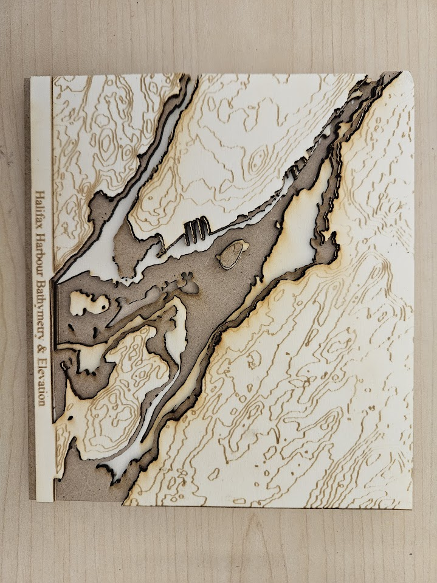

## Upload files to the DSC Portal 
Well done! Your .SVG file is now ready to be exported to the DSC, where they will be cut and engraved with our laser cutter. Go to the [new job portal](https://webapp.library.uvic.ca/3dprint/customer-new-job.php){:target="_blank"} and fill out the necessary information. There are several choices for material. If you are interested in staining or painting your project, plywood is the best choice due to its light colour. 

  The upper example is made from 6mm plywood, while the lower is made from 3mm plywood. 

 You can also request that different layers be cut out of different material, like the example below. Please note that if you choose to do this, you will need to submit two separate files - one of all layers to be cut out of the first material, one of all the layers to be cut out of the second. 

